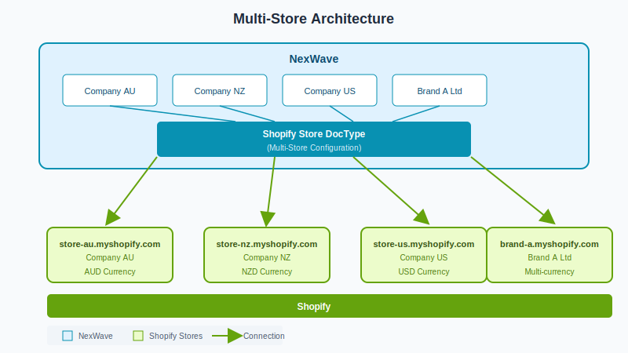
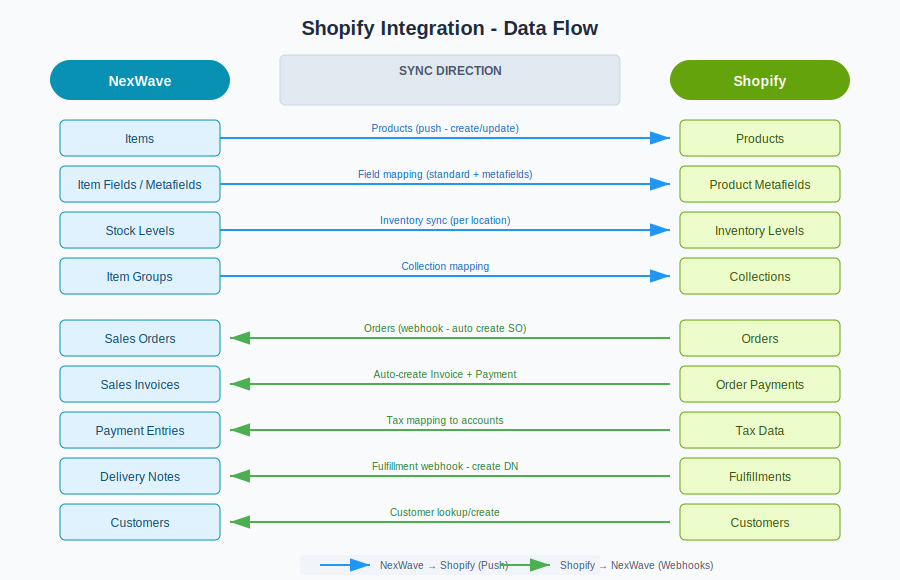

# ERPNext Shopify Connector

Multi-store Shopify connector for ERPNext, designed to connect multiple Shopify stores to a single ERPNext instance with multi-company support. Built and maintained by [HighFlyer](https://highflyerglobal.com/).

> Works with any ERPNext v15+ instance. No additional dependencies beyond ERPNext.

## Key Features

### Multi-Store, Multi-Company
Connect multiple Shopify stores to one ERPNext instance, each mapped to a separate company for proper accounting separation.

### Real-Time Order Sync
Webhook-based order ingestion with HMAC validation. Orders are automatically routed to the correct company based on store configuration. Supports automatic submission, invoicing, and payment entry creation for paid orders.

### Fulfillment Sync
Listens to Shopify fulfillment webhooks and automatically creates Delivery Notes with tracking information. Handles partial fulfillments and prevents duplicates.

### Product and Inventory Push
Sync items from ERPNext to Shopify with configurable field mapping (standard fields and metafields). Push stock levels from ERPNext warehouses to Shopify locations with multi-location support.

### Configurable Tax Handling
- "On Net Total" approach for clean, efficient tax calculation
- Automatic zero-rated item detection with item tax template overrides
- Multi-region support (NZ 15% GST, AU 10% GST, and others)
- Shipping tax handling (as line item or separate tax row)
- Automatic rounding adjustments for Shopify/ERPNext total matching

### Collection Mapping
Map ERPNext field values (item group, brand, etc.) to Shopify Custom Collections for automatic product categorization during sync.

### Payment Method Mapping
Map Shopify payment gateways to ERPNext Mode of Payment for accurate payment tracking.

### OAuth 2.0 and Legacy Auth
Supports modern OAuth flow (recommended for new integrations) and legacy access tokens for existing custom apps.

### SKU-Based Migration Tool
Link existing Shopify products to ERPNext items by matching SKUs. Generates a report of matched, unmatched, and conflicting items.

### Item Eligibility Filters
Control which items sync to which stores using manual overrides or automatic filter rules (e.g., "if field X has value, sync to store Y").

## Data Flow

## Documentation

- [Shopify Integration Overview](https://docs.nexwaveapp.com/s/docs/doc/shopify-integration-L1ofBu1m6e)
- [Shopify Connector Setup Guide](https://docs.nexwaveapp.com/s/docs/doc/shopify-connector-setup-guide-hpVraqmSVk)
- [Developer Guide](docs/developer-guide.md)

## License

GNU General Public License v3.0
